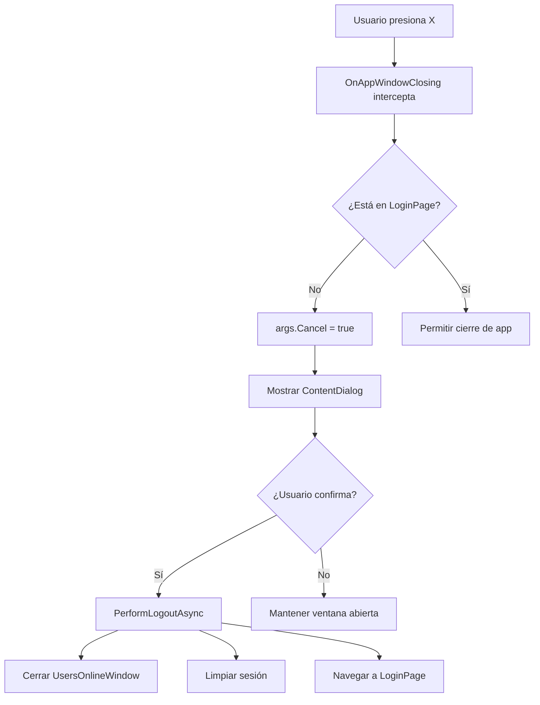
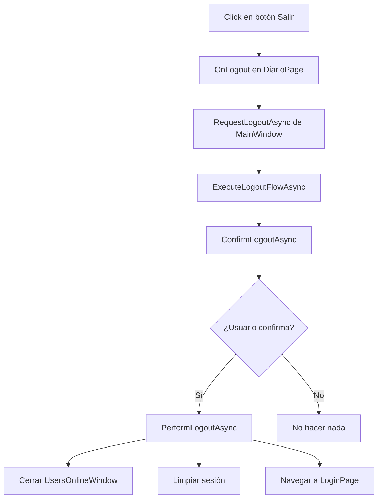

# Sistema de Logout al Cerrar Ventana (X)

## 📋 Descripción

Implementación del comportamiento de logout automático al pulsar la **X** (cerrar ventana) o **Alt+F4** en la ventana principal de GestionTime Desktop.

## ✨ Características

### 1. **Interceptación del Cierre**
- ✅ Al pulsar **X** o **Alt+F4**, la app NO se cierra directamente
- ✅ Se muestra el ContentDialog de confirmación: "¿Estás seguro de que deseas cerrar la sesión?"
- ✅ Si el usuario **cancela**: la ventana permanece abierta
- ✅ Si el usuario **confirma**: se ejecuta el logout y navega a LoginPage

### 2. **Comportamiento Especial en LoginPage**
- ✅ Si el usuario ya está en **LoginPage** y pulsa la X, la app SÍ se cierra directamente
- ✅ No se muestra dialog de confirmación (ya no hay sesión activa)

### 3. **Cierre de Ventanas Secundarias**
- ✅ Al hacer logout, se cierra automáticamente la ventana de **Usuarios Online** (si está abierta)
- ✅ Manejo seguro con try/catch para evitar crashes

### 4. **Código Reutilizable**
- ✅ Métodos centralizados en `MainWindow.xaml.cs`:
  - `ConfirmLogoutAsync()`: Muestra el dialog de confirmación
  - `PerformLogoutAsync()`: Ejecuta la limpieza de sesión
  - `ExecuteLogoutFlowAsync()`: Flujo completo (confirmación + limpieza + navegación)
  - `RequestLogoutAsync()`: Método público para invocar desde otras partes (ej: botón Salir)

### 5. **Logging Completo**
Todos los eventos se registran en `app.log`:
```
═══════════════════════════════════════════════════════════════
🚪 CIERRE DE VENTANA INTERCEPTADO (X / Alt+F4)
═══════════════════════════════════════════════════════════════
⏸️ Cierre cancelado - Mostrando dialog de confirmación
✅ Logout confirmado por el usuario
═══════════════════════════════════════════════════════════════
🚪 LOGOUT - Limpiando sesión y datos
═══════════════════════════════════════════════════════════════
🔒 Cerrando ventana de Usuarios Online...
✅ Ventana de Usuarios Online cerrada correctamente
✅ Información de usuario limpiada del archivo
✅ Token de autenticación eliminado
✅ Caché de peticiones limpiado
✅ Datos de sesión limpiados
═══════════════════════════════════════════════════════════════
✅ LOGOUT COMPLETADO - Navegando al login
═══════════════════════════════════════════════════════════════
✅ Navegación a LoginPage exitosa
```

## 🏗️ Implementación Técnica

### Archivos Modificados

#### 1. **MainWindow.xaml.cs**

**Usings añadidos:**
```csharp
using Microsoft.UI.Windowing;
using WinRT.Interop;
using Microsoft.UI;
```

**Nuevos miembros:**
```csharp
private bool _isClosingHandled = false; // Flag para evitar loops
```

**Método principal:**
```csharp
private void SubscribeToWindowClosing()
{
    var hWnd = WindowNative.GetWindowHandle(this);
    var windowId = Microsoft.UI.Win32Interop.GetWindowIdFromWindow(hWnd);
    var appWindow = AppWindow.GetFromWindowId(windowId);
    
    if (appWindow != null)
    {
        appWindow.Closing += OnAppWindowClosing;
    }
}
```

**Handler del cierre:**
```csharp
private void OnAppWindowClosing(AppWindow sender, AppWindowClosingEventArgs args)
{
    // Si estamos en LoginPage, permitir el cierre
    if (_currentPageType == typeof(Views.LoginPage))
    {
        return; // NO cancelar
    }
    
    // Cancelar el cierre y ejecutar logout
    args.Cancel = true;
    _ = ExecuteLogoutFlowAsync();
}
```

**Métodos reutilizables:**
- `ExecuteLogoutFlowAsync()`: Flujo completo de logout
- `ConfirmLogoutAsync()`: Dialog de confirmación
- `PerformLogoutAsync()`: Limpieza de sesión
- `CloseUsersOnlineWindow()`: Cierra ventana secundaria
- `RequestLogoutAsync()`: Método público para invocar desde otras partes

#### 2. **Views\DiarioPage.xaml.cs**

**Antes (código duplicado):**
```csharp
private async void OnLogout(object sender, RoutedEventArgs e)
{
    // ... 70 líneas de código duplicado
    var confirmDialog = new ContentDialog { ... };
    // ... limpieza manual ...
    App.MainWindowInstance?.Navigator?.Navigate(typeof(LoginPage));
}
```

**Después (reutiliza código centralizado):**
```csharp
private async void OnLogout(object sender, RoutedEventArgs e)
{
    App.Log?.LogInformation("Usuario solicitó logout desde botón Salir");
    
    if (App.MainWindowInstance != null)
    {
        await App.MainWindowInstance.RequestLogoutAsync();
    }
}
```

## 🎯 Flujo de Ejecución

### Escenario 1: Usuario en DiarioPage presiona X



### Escenario 2: Usuario presiona botón Salir



## 🔒 Protecciones Implementadas

### 1. **Evitar Loops Infinitos**
```csharp
private bool _isClosingHandled = false;

if (_isClosingHandled) return; // Evita re-ejecución

_isClosingHandled = true;
try {
    await ExecuteLogoutFlowAsync();
} finally {
    _isClosingHandled = false; // Resetear para futuros intentos
}
```

### 2. **Manejo Seguro de Ventanas Secundarias**
```csharp
private void CloseUsersOnlineWindow()
{
    try
    {
        if (App.UsersWindowInstance != null)
        {
            App.UsersWindowInstance.Close();
        }
    }
    catch (Exception ex)
    {
        App.Log?.LogWarning(ex, "Error cerrando ventana (puede ya estar cerrada)");
    }
    finally
    {
        App.UsersWindowInstance = null; // Limpiar referencia siempre
    }
}
```

### 3. **Navegación Segura con DispatcherQueue**
```csharp
DispatcherQueue.TryEnqueue(() =>
{
    try
    {
        RootFrame.Navigate(typeof(Views.LoginPage));
    }
    catch (Exception ex)
    {
        App.Log?.LogError(ex, "Error navegando a LoginPage");
    }
});
```

## 🧪 Casos de Prueba

| # | Escenario | Resultado Esperado | ✅ |
|---|-----------|-------------------|---|
| 1 | Usuario en DiarioPage presiona X | Muestra dialog de confirmación | ✅ |
| 2 | Usuario confirma logout | Navega a LoginPage sin cerrar app | ✅ |
| 3 | Usuario cancela logout | Ventana permanece abierta | ✅ |
| 4 | Usuario en LoginPage presiona X | App se cierra directamente | ✅ |
| 5 | Ventana UsersOnline abierta al hacer logout | Se cierra automáticamente | ✅ |
| 6 | Usuario presiona botón Salir | Mismo comportamiento que X | ✅ |
| 7 | Doble clic en X muy rápido | Flag _isClosingHandled evita duplicados | ✅ |

## 📝 Notas Importantes

### WinUI 3 y AppWindow.Closing

En WinUI 3, el evento `Window.Closed` se ejecuta **después** de que la ventana ya está cerrada, por lo que NO se puede cancelar.

Para interceptar y cancelar el cierre, se debe usar:
- `AppWindow.Closing` (puede cancelarse con `args.Cancel = true`)

**Código clave:**
```csharp
var hWnd = WindowNative.GetWindowHandle(this);
var windowId = Microsoft.UI.Win32Interop.GetWindowIdFromWindow(hWnd);
var appWindow = AppWindow.GetFromWindowId(windowId);

appWindow.Closing += (sender, args) => {
    args.Cancel = true; // ✅ Cancela el cierre
};
```

### Limitación: Async en Closing

El evento `Closing` **no permite métodos async directos**, por lo que usamos:
```csharp
_ = ExecuteLogoutFlowAsync(); // Fire-and-forget con manejo interno
```

Y mantenemos `args.Cancel = true` para evitar que la ventana se cierre mientras se ejecuta el flujo async.

## 🚀 Beneficios

1. ✅ **UX mejorada**: El usuario no pierde datos accidentalmente
2. ✅ **Código limpio**: Lógica centralizada, sin duplicación
3. ✅ **Seguridad**: Limpieza completa de sesión al cerrar
4. ✅ **Logging completo**: Trazabilidad de todos los eventos
5. ✅ **Robusto**: Manejo de errores en todos los puntos críticos

## 🔄 Versión

**Implementado en:** v1.5.0-beta  
**Fecha:** 2024  
**Autor:** GestionTime Development Team
